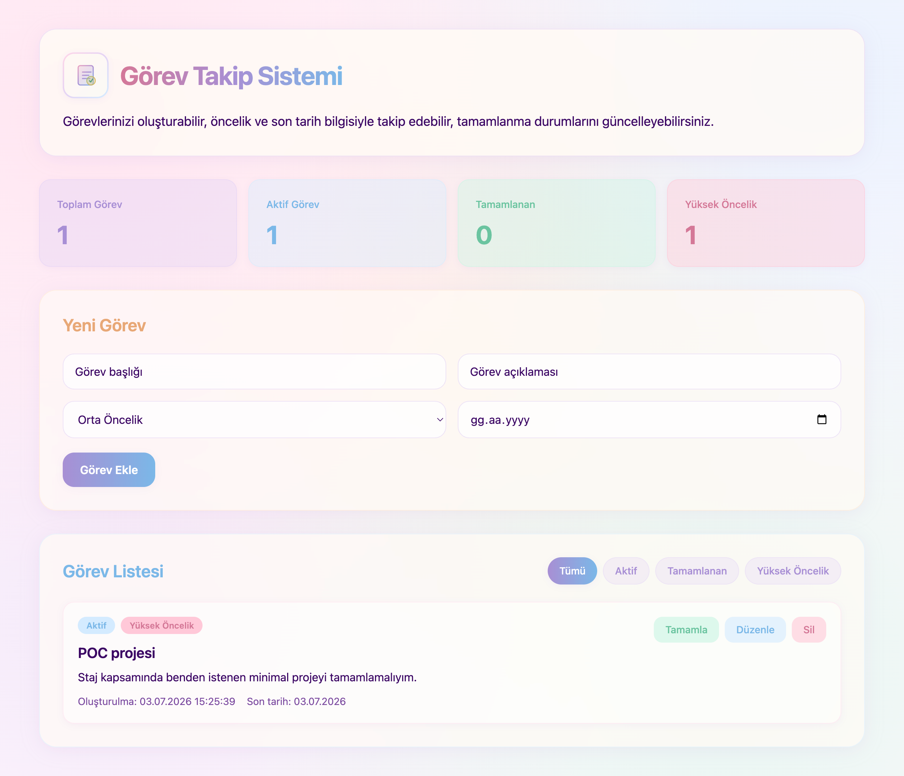

# Görev Takip Sistemi

Görev Takip Sistemi, görevlerin oluşturulmasını, öncelik ve son tarih bilgisiyle takip edilmesini, tamamlanma durumlarının güncellenmesini sağlayan full stack bir POC projesidir.

Bu proje; frontend, backend, veritabanı, Docker ve Git/GitHub kullanımını uçtan uca küçük bir uygulama üzerinde birleştirmek amacıyla geliştirilmiştir.

## Projenin Ekran Görüntüsü

```md

```

## Kullanılan Teknolojiler

- React
- TypeScript
- Tailwind CSS
- .NET 8 Web API
- Entity Framework Core
- PostgreSQL
- Docker
- Docker Compose

## Özellikler

- Yeni görev oluşturma
- Görevleri listeleme
- Görev durumunu tamamlama veya aktif hale getirme
- Görev düzenleme
- Görev silme
- Öncelik seviyesi belirleme
- Son tarih seçme
- Geçmiş tarih seçimini engelleme
- Görevleri duruma ve önceliğe göre filtreleme
- PostgreSQL üzerinde veri saklama
- Docker Compose ile tüm projeyi tek komutla çalıştırma

## Proje Yapısı

```text
mini-task-tracker-poc
├── backend
│   ├── Controllers
│   ├── Data
│   ├── Models
│   ├── Migrations
│   ├── Dockerfile
│   └── Program.cs
├── frontend
│   ├── src
│   ├── Dockerfile
│   └── package.json
├── docker-compose.yml
└── README.md
```

## Çalıştırma

Projeyi çalıştırmak için Docker Desktop açıkken ana dizinde aşağıdaki komut çalıştırılır:

```bash
docker compose up --build
```

Frontend uygulaması:

```text
http://localhost:3000
```

Backend Swagger arayüzü:

```text
http://localhost:5001/swagger
```

Projeyi durdurmak için:

```bash
docker compose down
```

Veritabanı dahil tüm container verilerini sıfırlamak için:

```bash
docker compose down -v
```

## API Endpointleri

```text
GET     /api/TaskItems
GET     /api/TaskItems/{id}
POST    /api/TaskItems
PUT     /api/TaskItems/{id}
DELETE  /api/TaskItems/{id}
```

## Amaç

Bu POC çalışmasının amacı; React, TypeScript, Tailwind CSS, .NET Web API, PostgreSQL, Docker Compose ve GitHub kullanımını bir araya getirerek uçtan uca çalışan küçük bir full stack uygulama geliştirmektir.